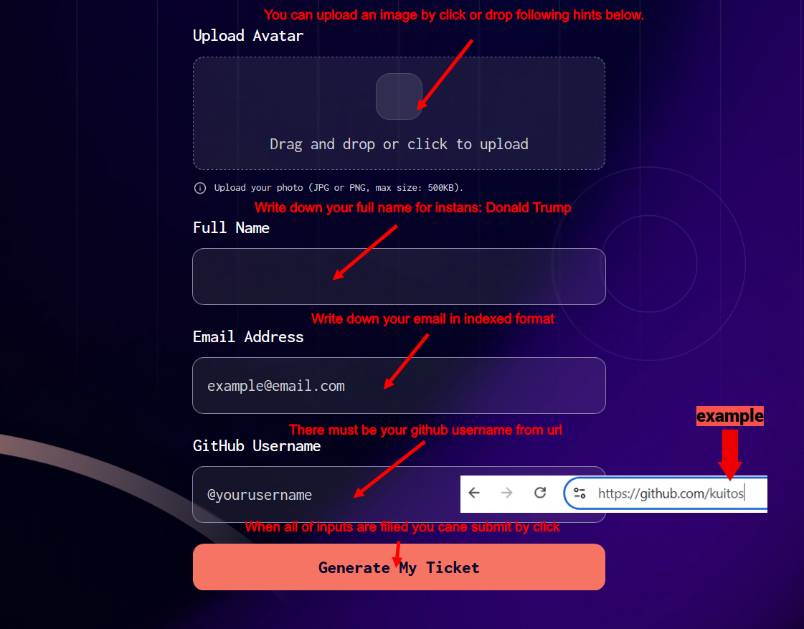

# Frontend Mentor - Conference ticket generator solution

This is a solution to the [Conference ticket generator challenge on Frontend Mentor](https://www.frontendmentor.io/challenges/conference-ticket-generator-oq5gFIU12w). Frontend Mentor challenges help you improve your coding skills by building realistic projects.

## Table of contents

- [Overview](#overview)
  - [The challenge](#the-challenge)
  - [Screenshot](#screenshot)
  - [Links](#links)
- [My process](#my-process)
  - [Built with](#built-with)
  - [What I learned](#what-i-learned)
  - [Continued development](#continued-development)
  - [Useful resources](#useful-resources)
- [Author](#author)

## Overview

### The challenge

Users should be able to:

- Complete the form with their details
- Receive form validation messages if:
  - Any field is missed
  - The email address is not formatted correctly
  - The avatar upload is too big or the wrong image format
- Complete the form only using their keyboard
- Have inputs, form field hints, and error messages announced on their screen reader
- See the generated conference ticket when they successfully submit the form
- View the optimal layout for the interface depending on their device's screen size
- See hover and focus states for all interactive elements on the page

### Screenshot



### Links

- Solution URL: [Github page](https://github.com/DmytroVoitovych/Conference-ticket)
- Live Site URL: [Live page](https://dmytrovoitovych.github.io/Conference-ticket/)

## My process

### Built with

- Semantic HTML5 markup
- CSS custom properties
- Flexbox
- CSS Grid
- DOM manipulation
- Mutation observer API
- FormData
- [Anime.js](https://animejs.com/) - JS library

### What I learned

In this challenge, I had the opportunity to work with `"drag" and "drop"` events and to transfer file data in a form. This experience motivated me to dig deeper into learning about the `File API and DataTransfer`.
Additionally, I explored CSS properties like `clip-path and border-image`,
which allowed me to dive deeper into CSS.
Finally, creating animations for elements was the most difficult task for me, but it led me to discover an incredibly simple and remarkable animation library: `Anime.js`.

Code snippet is a function that takes a numeric ID as a parameter and
passes animation options to imitate "counting behavior."
See below:

```js
const generateId = (specString, id) =>
  anime({
    targets: ticketId,
    textContent: [1000, id],
    round: 1,
    duration: 1000,
    easing: "linear",
    update: (anim) => {
      const target = anim.animatables[0].target;
      target.textContent =
        specString +
        `${target.textContent}`.padStart(5, "0");
    },
  });
```

### Continued development

In my next project, I plan to use either React.js or Astro.js, depending on the project requirements. Since React 19 is finally out, I'm curious if it's improved. I'm also waiting for the "Vapor Mode" update from the Vue.js team.

### Useful resources

- [Anime.js](https://animejs.com/) - This helped me to create animations without headaches.
- [HTML Drag and Drop API](https://developer.mozilla.org/en-US/docs/Web/API/HTML_Drag_and_Drop_API) - I'd recommend it to anyone still learning this concept.

## Author

- Website - [Dmytro Voitovych](https://portfolio-dmytrovoitovych.vercel.app/)
